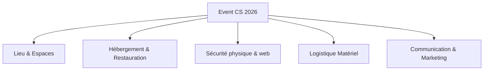

# CAHIER DES CHARGES — EVENT CS 2026

## 1. Introduction
Ce document présente le cahier des charges officiel pour l'organisation et la mise en œuvre de la plateforme web de l'**Event CS 2026**, un tournoi compétitif d'Esport Counter-Strike organisé par **EventAndParty** à Yverdon-les-Bains.

---

## 2. Objectifs Globaux
* **Affluence cible** : Accueillir environ 500 spectateurs par jour sur deux jours (les 23 et 24 mai 2026).
* **Confort & Performance** : Mettre à disposition des joueurs professionnels et des spectateurs des infrastructures gaming de pointe.
* **Cible financière** : Atteindre un chiffre d'affaires consolidé situé entre **CHF 90'000.00 et CHF 110'000.00** par le biais de la billetterie physique, des ventes de nourriture/boisson et des partenariats de sponsoring.
* **Digitalisation** : Fournir une plateforme web complète gérant à la fois la vitrine publique (billetterie, résultats) et les outils logistiques administrateurs (gestion des produits, des matchs, rapports financiers).

---

## 3. Périmètre & Organisation Événementielle (5 Domaines)

### 3.1. Lieu (Zone Spectateurs & Pro)
* **Lieu** : Complexe de **La Marive, Yverdon-les-Bains**.
* **Capacité** : 500 places assises avec écran LED géant de retransmission.
* **Espace Joueurs** : 4 zones insonorisées fermées (cabines de jeu) pour l'équité des équipes et l'isolation acoustique pendant les matchs.

### 3.2. Hébergement & Restauration
* Prise en charge complète des 4 équipes d'élites invitées (20 joueurs + staffs).
* Hébergement dans l'Hôtel partenaire 4 étoiles situé à Yverdon-les-Bains.
* **Budget alloué** : CHF 50.00 par jour et par personne pour la restauration équilibrée.

### 3.3. Sécurité (Physique & Logicielle)
* **Physique** : Partenariat officiel avec **Securitas SA** pour assurer le contrôle des flux à l'entrée de La Marive, la sécurité incendie et la gestion des attroupements.
* **Logicielle** : Protection du site internet contre les attaques DDoS, chiffrement SSL pour toutes les transactions financières et double authentification (2FA) obligatoire pour l'accès aux privilèges d'administration.

### 3.4. Logistique Matériel (Gaming & Réseau)
* Matériel haut de gamme : PC équipés de cartes graphiques NVIDIA RTX 4080 minimum, moniteurs de jeu à 360 Hz.
* Ligne réseau fibrée symétrique dédiée avec redondance 4G/5G pour éliminer tout risque de déconnexion.
* Navettes privées assurant la liaison régulière entre la gare d'Yverdon-les-Bains et La Marive pour les équipes.

### 3.5. Communication & Marketing
* Promotion multi-canal : Réseaux sociaux grand public (Instagram, TikTok, X), distribution de flyers physiques dans la région Nord Vaudois et teasers vidéo.
* Diffusion en direct (castée en français) sur la chaîne Twitch officielle du tournoi.

---

## 4. Architecture de la Plateforme Web

### 4.1. Front-Office (Espace Spectateurs)
1. **Accueil & Infos** : Présentation dynamique de l'événement, localisation à La Marive et dates clés (23-24 mai 2026).
2. **Billetterie Sécurisée** : Grille de tarifs (Pass 1 jour, Pass Weekend, Pass VIP Premium) avec indicateurs de stocks restants.
3. **Panier d'achat** : Commande multi-produits interactive.
4. **Paiement Simulé** : Simulation de paiement instantané via TWINT ou Carte Bancaire.
5. **Émission de Billet** : Génération de billets nominatifs munis d'un QR code unique prêt à imprimer.
6. **Résultats en direct** : Bracket des demi-finales et de la finale avec flux d'événements de rounds interactif.

### 4.2. Back-Office (Espace Administrateurs)
1. **Authentification 2FA** : Accès protégé par email/mot de passe complété par un code d'authentification jetable à 6 chiffres.
2. **Tableau de Bord Financier** : Suivi en temps réel des ventes de billets cumulées aux revenus de sponsoring pour piloter l'atteinte de la cible financière (CHF 90k - 110k).
3. **Gestion de Billetterie** : Modification des prix, ajustement des stocks globaux ou des descriptions des billets.
4. **Suivi des Commandes** : Table listant les acheteurs et leurs transactions.
5. **Gestion du Tournoi** : Console d'arbitrage permettant de modifier les scores en temps réel, de changer le statut des matchs (Planifié, En Direct, Terminé) et d'ajouter manuellement des logs d'actions marquantes dans le fil de direct.
